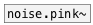

[< reference home](ceammc_lib.html)
---

# noise.white~


White noise generator

---

outputs random numbers between -1 and 1 at signal rate.<br>


---


```


[ui.dsp~]


[noise.white~]
|
|
|
[ui.scope~]

            
```

---
arguments:


---
properties:


---
see also:<br>
[](noise.pink~.html)
