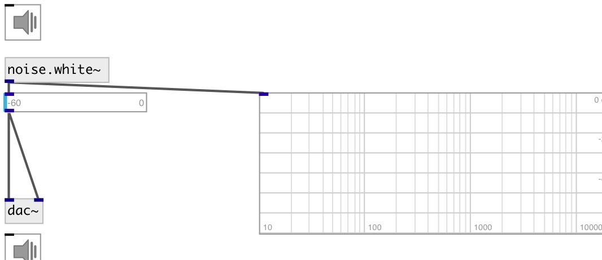

[index](index.html) :: [noise](category_noise.html)
---

# noise.white~

###### White noise generator

*available since version:* 0.1

---

## information
outputs random numbers between -1 and 1 at signal rate.

## properties:

* **@active** 
Get/set on/off dsp processing 
_type:_ int 
_enum:_ 0, 1 
_default:_ 1 

## outlets:

* output signal 
_type:_ audio

## keywords:

[noise](keywords/noise.html)
[white](keywords/white.html)

**See also:**
[\[noise.pink~\]](noise.pink~.html)

**Authors:** Serge Poltavsky

**License:** GPL3 or later

