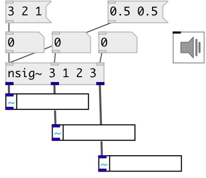

[index](index.html) :: [base](category_base.html)
---

# nsig~
**aliases:** [ceammc/nsig\~]

###### Mulitchannel converter from control to audio rate

*available since version:* 0.9

---

## arguments:

* **NUM**
@n property 
_type:_ float 

* **INIT**
init values 
_type:_ list 

## properties:

* **@n** 
Get/set number of inputs/outputs 
_type:_ int 
_range:_ 1..12 
_default:_ 1 

* **@values** 
Get/set current output values. Default: 0 
_type:_ list 

## inlets:

* set first output value 
_type:_ control
* set ... output value 
_type:_ control
* set n-th output value 
_type:_ control

## outlets:

* first value output 
_type:_ audio
* ... value output 
_type:_ audio
* n-th value output 
_type:_ audio

## keywords:

[sig](keywords/sig.html)
[list](keywords/list.html)

**See also:**
[\[sig~\]](sig~.html)

**Authors:** Serge Poltavsky

**License:** GPL3 or later

