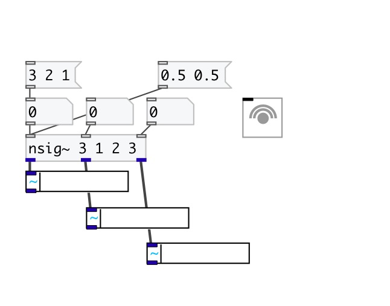
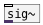

[< reference home](index.html)
---

# nsig~

Mulitchannel converter from control to audio rate

---

 

---

---
arguments:

NUM: @n property 
INIT: init values 

---
properties:

@n: number of
            inputs/outputs 
@values: current output values 

---
see also: 

