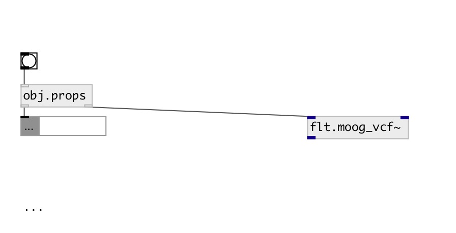

[index](index.html) :: [base](category_base.html)
---

# obj.props

###### property extractor

*available since version:* 0.7

---

## information
extract properties from object, connected to second outlet

## inlets:

* output extracted properties to first outlet 
_type:_ control

## outlets:

* property output (data:dict) 
_type:_ control
* connect to examined object 
_type:_ control

## keywords:

[property](keywords/property.html)

**Authors:** Serge Poltavsky

**License:** GPL3 or later

