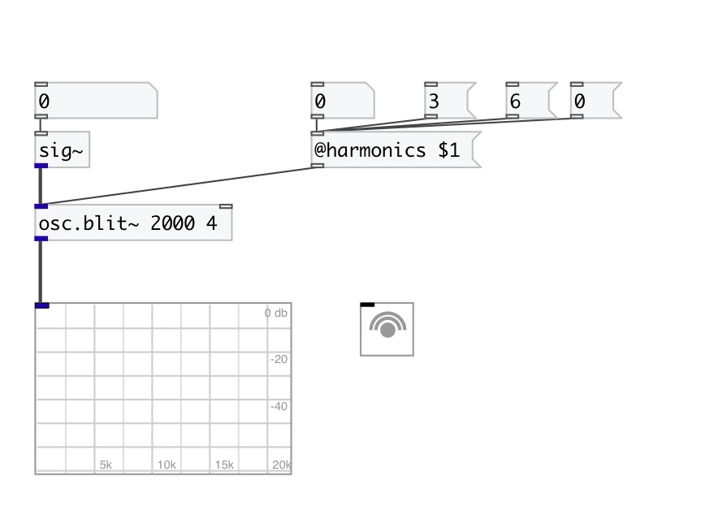

[< reference home](index.html)
---

# osc.blit~

Bandlimited impulse train oscillator

---

 

---

---
arguments:

freq(Hz): default frequency (440hz
            if not specified) 

---
properties:

@harmonics: number of harmonics. 0
            means all available harmonics until SR/2 

---
see also: 

