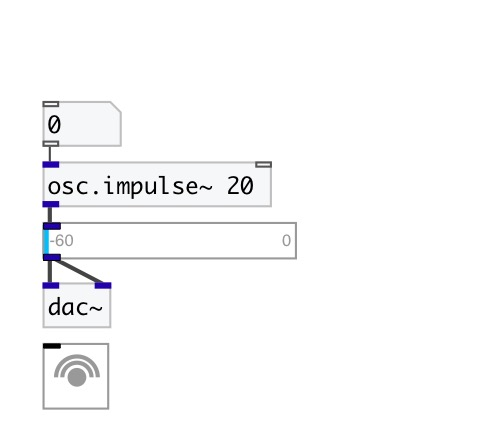

[< reference home](index.html)
---

# osc.impulse~

Bandlimited impulse train generator

---

 

---

---
arguments:

freq(Hz): frequency 

---
properties:

@active: on/off dsp
            processing 

---
see also: 

