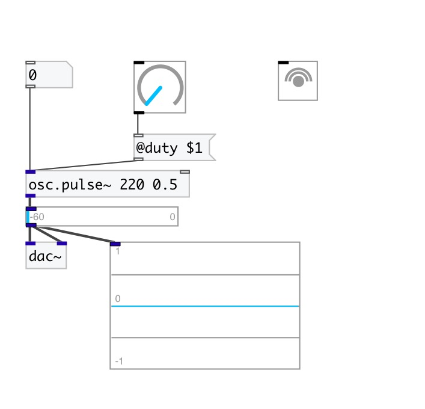

[< reference home](index.html)
---

# osc.pulse~

Bandlimited pulse train oscillator

---

 

---

---
arguments:

freq(Hz): frequency 
duty: duty cycle 

---
properties:

@active: on/off dsp
            processing 
@duty: duty
            cycle 

---
see also: 

