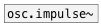

[<<< reference home](ceammc_lib.md)
---

# osc.pulse~

```


[F]      [ui.knob]   [ui.dsp~]
|        |
|        |
|        |
|        [@duty $1(
|        |
[osc.pulse~ 220 0.5]
|
[ui.gain~ @size 120 14]
|\     |
[dac~] [ui.scope~]


            
```
---
Bandlimited pulse train oscillator
---
arguments:

freq(Hz): frequency<br>
duty: duty cycle<br>

---
properties:

@active: on/off dsp
            processing<br>
@duty: duty
            cycle<br>

---
see also:<br>
[](osc.impulse~.md)
