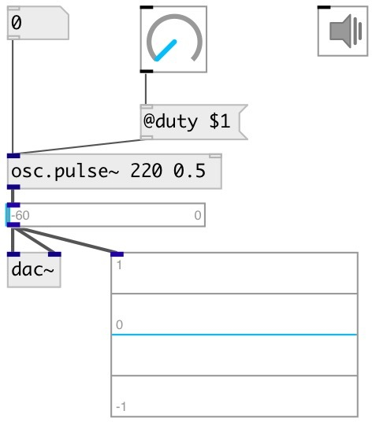

[index](index.html) :: [osc](category_osc.html)
---

# osc.pulse~

###### Bandlimited pulse train oscillator

*available since version:* 0.1

---

## arguments:

* **freq**
frequency 
__type:__ float 
__units:__ Hz 

* **duty**
duty cycle 
__type:__ float 

## properties:

* **@active** 
Get/set on/off dsp processing 
__type:__ int 
__enum:__ 0, 1 
__default:__ 1 

* **@duty** 
Get/set duty cycle 
__type:__ float 
__range:__ 0..1 
__default:__ 0.5 

## inlets:

* frequency in Hz 
__type:__ audio 
* reset phase 
__type:__ control 

## outlets:

* output signal
__type:__ audio 

## keywords:

[oscillator](keywords/oscillator.html)
[band-limited](keywords/band-limited.html)

**See also:**
[\[osc.impulse~\]](osc.impulse~.html)

**Authors:** Serge Poltavsky

**License:** GPL3 or later

