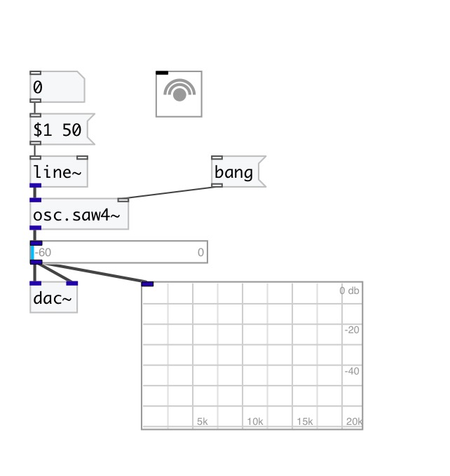

[< reference home](index.html)
---

# osc.saw4~

Bandlimited sawtooth wave

---

Differentiated Polynomial Waves (DPW) used for aliasing suppression. 4nd order
            interpolation.
 

---

---
arguments:

freq(Hz): frequency 

---
properties:

@active: on/off dsp
            processing 
@phase: 
            phase 

---
see also: 

