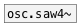

[<<< reference home](ceammc_lib.md)
---

# osc.saw~

```


[F]      [ui.dsp~]
|
[$1 50(
|
[line~]  [bang(
|        |.
[osc.saw~ ]
|
[ui.gain~ @size 120 14]
|\      |
[dac~]  [ui.spectroscope~]


            
```
---
Alias-free sawtooth wave
---
arguments:

freq(Hz): frequency<br>

---
properties:

@active: on/off dsp
            processing<br>

---
see also:<br>
[](osc.saw4~.md)
[](osc.tri~.md)
[](osc.square~.md)
[](lfo.tri~.md)
