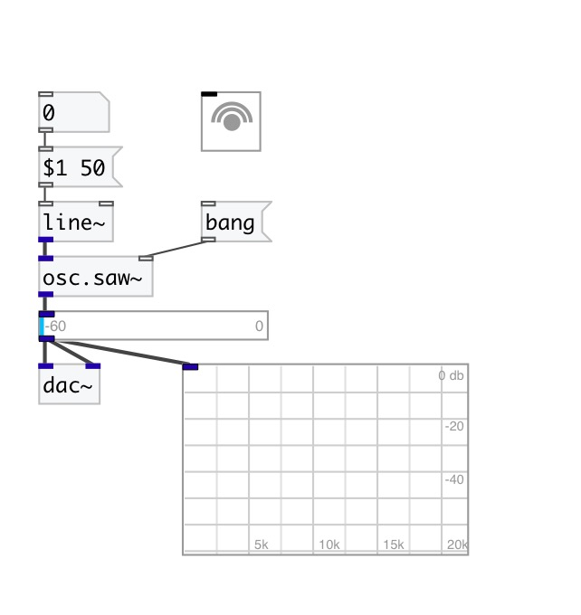

[< reference home](index.html)
---

# osc.saw~

Alias-free sawtooth wave

---

Polynomial Transition Regions (PTR) used for aliasing suppression. 2nd order
            interpolation.
 

---

---
arguments:

freq(Hz): frequency 

---
properties:

@active: on/off dsp
            processing 

---
see also: 

