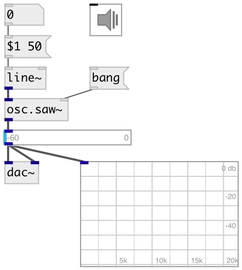

[index](index.html) :: [osc](category_osc.html)
---

# osc.saw~

###### Alias-free sawtooth wave

*available since version:* 0.1

---

## information
Polynomial Transition Regions (PTR) used for aliasing suppression. 2nd order
            interpolation.

## arguments:

* **freq**
frequency 
__type:__ float 
__units:__ Hz 

## properties:

* **@active** 
Get/set on/off dsp processing 
__type:__ int 
__enum:__ 0, 1 
__default:__ 1 

## inlets:

* frequency in Hz 
__type:__ audio 
* reset phase 
__type:__ control 

## outlets:

* output signal
__type:__ audio 

## keywords:

[oscillator](keywords/oscillator.html)
[band-limited](keywords/band-limited.html)

**See also:**
[\[osc.saw4~\]](osc.saw4~.html)
[\[osc.tri~\]](osc.tri~.html)
[\[osc.square~\]](osc.square~.html)
[\[lfo.tri~\]](lfo.tri~.html)

**Authors:** Serge Poltavsky

**License:** GPL3 or later

