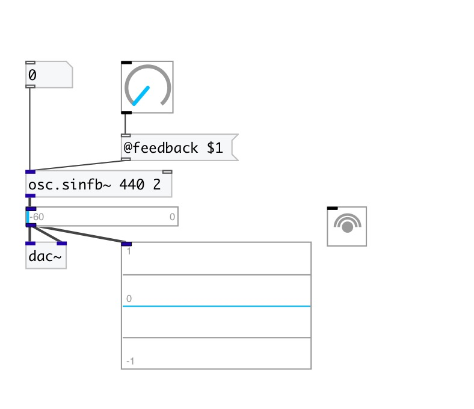

[< reference home](index.html)
---

# osc.sinfb~

Sine oscilator with feedback

---

 

---

---
arguments:

freq(Hz): initial
            frequency 
feedback: oscillator
            feedback coefficient in range 0..2pi 

---
properties:

@feedback: 
            oscillator feedback coefficient 
@active: on/off dsp
            processing 

