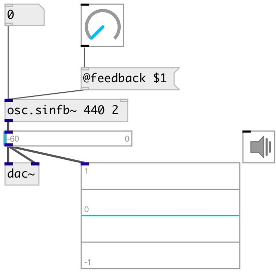

[index](index.html) :: [osc](category_osc.html)
---

# osc.sinfb~

###### Sine oscilator with feedback

*available since version:* 0.1

---

## arguments:

* **freq**
initial frequency 
__type:__ float 
__units:__ Hz 

* **feedback**
oscillator feedback coefficient in range 0..2pi 
__type:__ float 

## properties:

* **@feedback** 
Get/set oscillator feedback coefficient 
__type:__ float 
__range:__ 0..6.28319 
__default:__ 0 

* **@active** 
Get/set on/off dsp processing 
__type:__ int 
__enum:__ 0, 1 
__default:__ 1 

## inlets:

* frequency 
__type:__ audio 
* reset phase 
__type:__ control 

## outlets:

* output signal
__type:__ audio 

## keywords:

[osc](keywords/osc.html)
[feedback](keywords/feedback.html)

**Authors:** Serge Poltavsky

**License:** GPL3 or later

