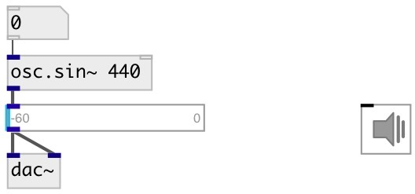

[index](index.html) :: [osc](category_osc.html)
---

# osc.sin~

###### Sine wave oscillator

*available since version:* 0.7

---

## information
included for library comprehension

## arguments:

* **FREQ**
frequency 
_type:_ float 
_units:_ Hz 

## properties:

* **@active** 
Get/set on/off dsp processing 
_type:_ bool 
_default:_ 1 

## inlets:

* frequency in Hz 
_type:_ audio
* reset phase 
_type:_ control

## outlets:

* output signal 
_type:_ audio

## keywords:

[oscillator](keywords/oscillator.html)
[band-limited](keywords/band-limited.html)

**See also:**
[\[osc.saw~\]](osc.saw~.html)
[\[osc.tri~\]](osc.tri~.html)
[\[osc.square~\]](osc.square~.html)
[\[lfo.impulse~\]](lfo.impulse~.html)

**Authors:** Serge Poltavsky

**License:** GPL3 or later

