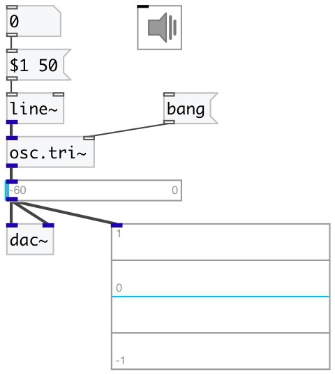

[index](index.html) :: [osc](category_osc.html)
---

# osc.tri~

###### bandlimited triangle wave oscillator

*available since version:* 0.1

---

## arguments:

* **FREQ**
See @freq 
_type:_ float 
_units:_ Hz 

## properties:

* **@osc** (initonly)
Get/set OSC server name to listen 
_type:_ symbol 

* **@id** (initonly)
Get/set OSC address id. If specified, bind all properties to /ID/osc_tri/PROP_NAME osc
address, if empty bind to /osc_tri/PROP_NAME. 
_type:_ symbol 

* **@active** 
Get/set on/off dsp processing 
_type:_ bool 
_default:_ 1 

* **@freq** 
Get/set frequency 
_type:_ float 
_units:_ Hz 
_range:_ 0..22050 
_default:_ 0 

## inlets:

* frequency in Hz 
_type:_ audio
* reset phase 
_type:_ control

## outlets:

* output signal in [1, -1] range 
_type:_ audio

## keywords:

[oscillator](keywords/oscillator.html)
[band-limited](keywords/band-limited.html)

**See also:**
[\[osc.saw~\]](osc.saw~.html)
[\[osc.square~\]](osc.square~.html)
[\[lfo.tri~\]](lfo.tri~.html)

**Authors:** Serge Poltavsky

**License:** GPL3 or later

