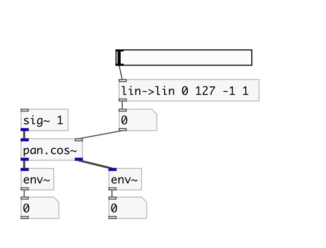

[< reference home](index.html)
---

# pan.cos~

two channel equal power sine/cosine panner

---

Two channel equal power panner. The center pan position is boosted by 3 dB
            compared to linear panning, and the total power at every pan position is 0 dB.
 

---

---
arguments:

POS: panning position. -1 means
            left, 0 - center, +1 - right 

---
properties:

@pos: panning
            position. -1 means left, 0 - center, +1 - right 
@smooth: smooth control signal to avoid zipping-noise 

---
see also: 

