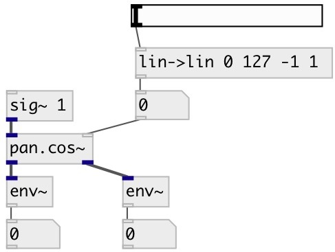

[index](index.html) :: [spat](category_spat.html)
---

# pan.cos~

###### two channel equal power sine/cosine panner

*available since version:* 0.5

---

## information
Two channel equal power panner. The center pan position is boosted by 3 dB
            compared to linear panning, and the total power at every pan position is 0 dB.

## arguments:

* **POS**
panning position. -1 means left, 0 - center, +1 - right 
_type:_ float 

## properties:

* **@pos** 
Get/set panning position. -1 means left, 0 - center, +1 - right 
_type:_ float 
_range:_ -1..1 
_default:_ 0 

* **@smooth** (readonly)
Get smooth control signal to avoid zipping-noise 
_type:_ int 
_range:_ 0..100 
_default:_ 20 

## inlets:

* input signal 
_type:_ audio
* pan position 
_type:_ control

## outlets:

* left output channel 
_type:_ audio
* right output channel 
_type:_ audio

## keywords:

[pan](keywords/pan.html)
[span](keywords/span.html)

**See also:**
[\[pan.lin~\]](pan.lin~.html)
[\[pan.sqrt~\]](pan.sqrt~.html)

**Authors:** Serge Poltavsky

**License:** GPL3 or later

