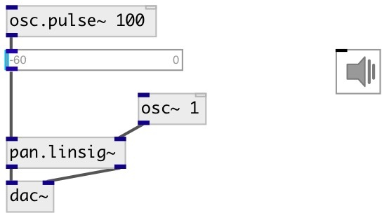

[index](index.html) :: [spat](category_spat.html)
---

# pan.linsig~

###### two channel linear panner with signal control

*available since version:* 0.7

---

## inlets:

* input signal 
_type:_ audio
* pan position 
_type:_ audio

## outlets:

* left output channel 
_type:_ audio
* right output channel 
_type:_ audio

## keywords:

[pan](keywords/pan.html)
[span](keywords/span.html)

**See also:**
[\[pan.sqrt~\]](pan.sqrt~.html)
[\[pan.cos~\]](pan.cos~.html)

**Authors:** Serge Poltavsky

**License:** GPL3 or later

