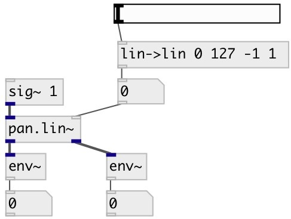

[index](index.html) :: [spat](category_spat.html)
---

# pan.lin~

###### two channel linear panner

*available since version:* 0.5

---

## information
The signal is lowered as it pans from left (or right) to center using a straight
            line from (+-)1 (left or right) to 0.0 (center) for a 6dB reduction in the
            middle.
A problem inherent to linear panning is that the perceived volume of the signal
            drops in the middle. [pan.sqrt~] solves this by taking the square root of the linear
            scaling factor going from 1 (left or right) to 0.5.sqrt (~=0.707) in the center, which
            is about 3dB reduction.
This is equal power panning. [pan.lin~] sounds more like the Rhodes tremolo than
            [pan.sqrt~].

## arguments:

* **POS**
panning position. -1 means left, 0 - center, +1 - right 
_type:_ float 

## properties:

* **@pos** 
Get/set panning position. -1 means left, 0 - center, +1 - right 
_type:_ float 
_range:_ -1..1 
_default:_ 0 

* **@smooth** (readonly)
Get smooth control signal to avoid zipping-noise 
_type:_ int 
_range:_ 0..100 
_default:_ 20 

## inlets:

* input signal 
_type:_ audio
* pan position 
_type:_ control

## outlets:

* left output channel 
_type:_ audio
* right output channel 
_type:_ audio

## keywords:

[pan](keywords/pan.html)
[span](keywords/span.html)

**See also:**
[\[pan.sqrt~\]](pan.sqrt~.html)
[\[pan.cos~\]](pan.cos~.html)

**Authors:** Serge Poltavsky

**License:** GPL3 or later

