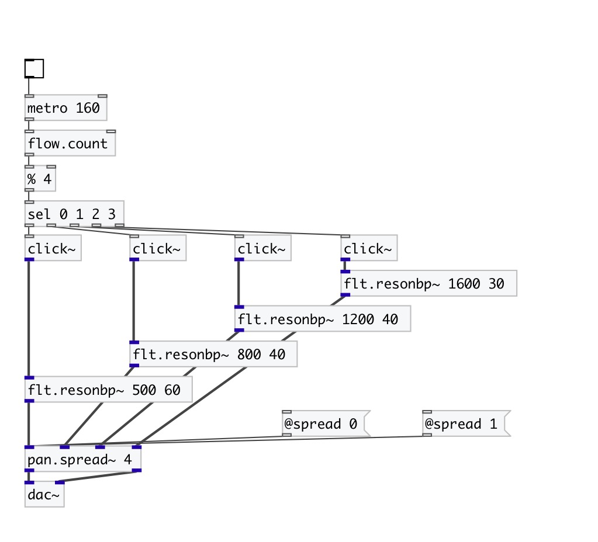

[< reference home](index.html)
---

# pan.spread~

spreads input channels across the stereo field

---

 

---

---
arguments:

N: number of input
            channels 

---
properties:

@ch: 
            number of input channels 
@spread: for @spread
            = 0, all channels are in the centre, for 1, they have maximum distribution 
@center: shift
            the centre of the distribution 
@compensate: compensate output level:
            divide amplitude to number of input channels 
@coeffs: list of gain pairs 

