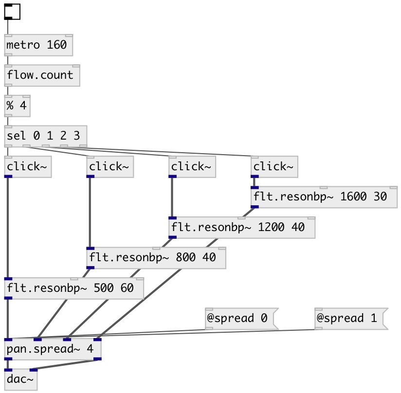

[index](index.html) :: [spat](category_spat.html)
---

# pan.spread~

###### spreads input channels across the stereo field

*available since version:* 0.5

---

## arguments:

* **N**
number of input channels 
__type:__ int 

## properties:

* **@ch** 
Get/set number of input channels 
__type:__ int 
__range:__ 2..16 
__default:__ 2 

* **@spread** 
Get/set for @spread = 0, all channels are in the centre, for 1, they have maximum
distribution 
__type:__ float 
__range:__ 0..1 
__default:__ 1 

* **@center** 
Get/set shift the centre of the distribution 
__type:__ float 
__range:__ -0.5..0.5 
__default:__ 0 

* **@compensate** 
Get/set compensate output level: divide amplitude to number of input channels 
__type:__ int 
__enum:__ 0, 1 
__default:__ 0 

* **@coeffs** (readonly)
Get list of gain pairs 
__type:__ list 

## inlets:

* input signal 
__type:__ audio 
* input signal 
__type:__ audio 
* input signal 
__type:__ audio 

## outlets:

* left output channel
__type:__ audio 
* right output channel
__type:__ audio 

## keywords:

[pan](keywords/pan.html)
[spread](keywords/spread.html)

**Authors:** Serge Poltavsky

**License:** GPL3 or later

