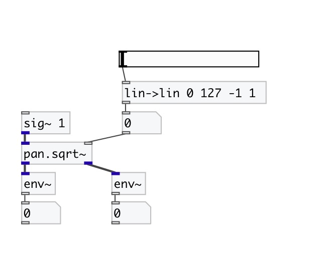

[< reference home](index.html)
---

# pan.sqrt~

two channel equal power square root panner

---

Two channel equal power panner. About is about 3dB center reduction. With linear
            panning ([pan.lin~]) the signal is lowered as it approaches center using a straight
            line from (+-)1 (left or right) to 0 (center) for a 6dB reduction in the middle.
A problem inherent to linear panning is that the perceived volume of the signal
            drops in the middle. [pan.sqrt~] solves this.
 

---

---
arguments:

POS: panning position. -1 means
            left, 0 - center, +1 - right 

---
properties:

@pos: panning
            position. -1 means left, 0 - center, +1 - right 
@smooth: smooth control signal to avoid zipping-noise 

---
see also: 

