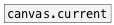

[< reference home](ceammc_lib.html)
---

# patch.args


Get patch or subpatch arguments

---

<br>


---


```


[loadbang]
|
[patch.args]
|
[msg set]
|
[ (

            
```

---
arguments:


---
properties:


---
see also:<br>
[](canvas.current.html)
[](canvas.top.html)
[](list->props.html)
