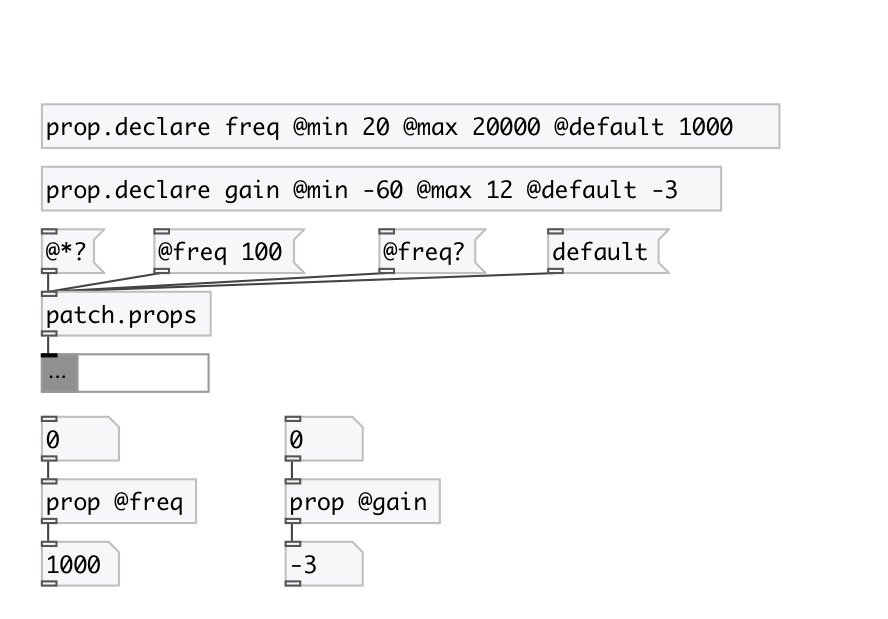

[index](index.html) :: [property](category_property.html)
---

# patch.props

###### patch properties manager

*available since version:* 0.7

---

## information
Property should be declared with [prop.declare]

## methods:

* **default**
reset all props to default value and output 

* **@*?**
output all patch properties as list 

## inlets:

* output all properties in [prop] objects 
__type:__ control 

## outlets:

* output value
__type:__ control 

## keywords:

[property](keywords/property.html)

**See also:**
[\[prop.declare\]](prop.declare.html)
[\[prop\]](prop.html)

**Authors:** Serge Poltavsky

**License:** GPL3 or later

