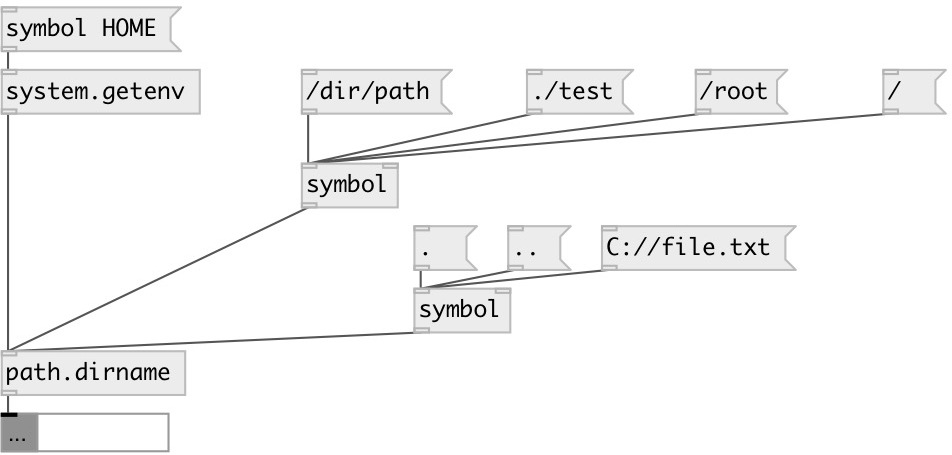

[index](index.html) :: [path](category_path.html)
---

# path.dirname

###### outputs directory portion of pathname

*available since version:* 0.1

---

## inlets:

* outputs directory portion of pathname 
__type:__ control 

## outlets:

* directory name
__type:__ control 

## keywords:

[path](keywords/path.html)
[environment](keywords/environment.html)

**See also:**
[\[path.basename\]](path.basename.html)

**Authors:** Serge Poltavsky

**License:** GPL3 or later

