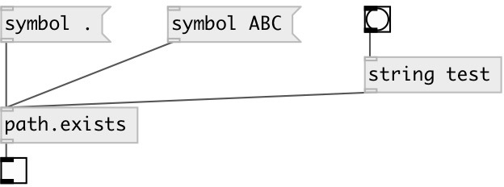

[index](index.html) :: [path](category_path.html)
---

# path.exists

###### checks if given path exists

*available since version:* 0.1

---

## inlets:

* checks if given path exists 
_type:_ control

## outlets:

* 1 - on success, 0 - if not exists 
_type:_ control

## keywords:

[path](keywords/path.html)
[exists](keywords/exists.html)

**Authors:** Serge Poltavsky

**License:** GPL3 or later

