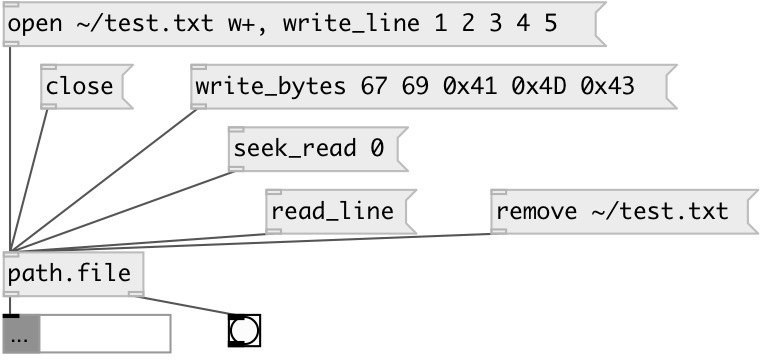

[index](index.html) :: [path](category_path.html)
---

# path.file

###### file input/output

*available since version:* 0.9.5

---

## methods:

* **close**
close file 

* **open**
open file, updates @path property 
  __parameters:__
  - **FNAME** file path: absolute or relative 
    type: symbol  
    required: True  

  - **[MODE]** open mode, &#39;r&#39;: open text file for reading only. &#39;w&#39;: truncate to 0 length, if existent, or create text file for writing only. &#39;a&#39;: append, open or create text file only for writing at end of file. &#39;r+&#39;: open text file for reading and writing. &#39;w+&#39;: truncate to 0 length, if existent, or create text file for reading and writing. &#39;a+&#39;: append, open or create text file for reading and writing, writing at end of file 
    type: symbol  

* **read_bytes**
read bytes from file, output as list of integers 
  __parameters:__
  - **[N]** number of bytes to read, if omitted read all content 
    type: int  

* **read_line**
read line from file, output as list as atoms 

* **remove**
remove file 
  __parameters:__
  - **NAME** file path 
    type: symbol  
    required: True  

* **rename**
rename file 
  __parameters:__
  - **PATH** old file path 
    type: symbol  
    required: True  

  - **NEW_PATH** new file path 
    type: symbol  
    required: True  

* **seek_read**
change reading position 
  __parameters:__
  - **POS** offset position 
    type: int  
    required: True  

  - **[ORIG]** offset origin, if omitted offset from the beginning 
    type: symbol  

* **seek_write**
change writing position 
  __parameters:__
  - **POS** offset position 
    type: int  
    required: True  

  - **[ORIG]** offset origin, if omitted offset from the beginning 
    type: symbol  

* **write**
write space separated atoms to file, no newline added 
  __parameters:__
  - **ARGS** atoms to write 
    type: list  
    required: True  

* **write_bytes**
write given bytes to file 
  __parameters:__
  - **ARGS** list of bytes: integers in 0-255 or symbols with &#39;0x&#39; prefix: 0x11, 0xFF etc.. 
    type: list  
    required: True  

* **write_line**
write space separated atoms to file, newline added 
  __parameters:__
  - **ARGS** atoms to write 
    type: list  
    required: True  

## properties:

* **@path** 
Get/set file path 
_type:_ symbol 

## inlets:

* ... 
_type:_ control

## outlets:

* list: read output 
_type:_ control
* bang on EOF reached 
_type:_ control

## keywords:

[path](keywords/path.html)
[file](keywords/file.html)

**Authors:** Serge Poltavsky

**License:** GPL3 or later

