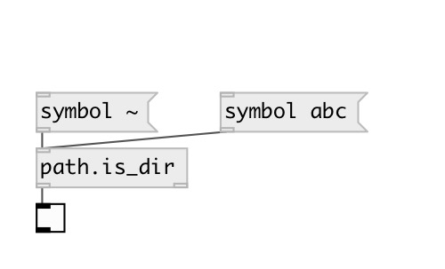

[index](index.html) :: [path](category_path.html)
---

# path.is_dir

###### check if path is directory

*available since version:* 0.9

---

## inlets:

* output 1 if given path is found and is directory, otherwise
                false 
__type:__ control 

## outlets:

* 1 or 0
__type:__ control 
* output path if it&#39;s directory
__type:__ control 

## keywords:

[path](keywords/path.html)
[dir](keywords/dir.html)

**Authors:** Serge Poltavsky

**License:** GPL3 or later

