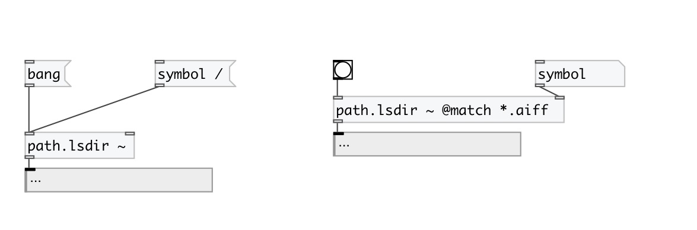

[< reference home](index.html)
---

# path.lsdir

list directory contents

---

 

---

---
arguments:

PATH: init directory value 

---
properties:

@match: match mask: for example *.wav for all wav
            files 

