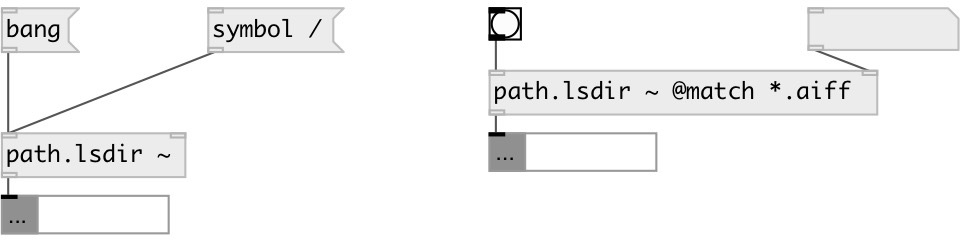

[index](index.html) :: [path](category_path.html)
---

# path.lsdir

###### list directory contents

*available since version:* 0.2

---

## arguments:

* **PATH**
init directory value 
__type:__ symbol 

## properties:

* **@match** 
Get/set match mask: for example *.wav for all wav files 
__type:__ symbol 

* **@path** 
Get/set current path 
__type:__ list 

## inlets:

* output directory content 
__type:__ control 
* set @match property 
__type:__ control 

## outlets:

* list of strings
__type:__ control 

## keywords:

[path](keywords/path.html)
[list](keywords/list.html)

**Authors:** Serge Poltavsky

**License:** GPL3 or later

