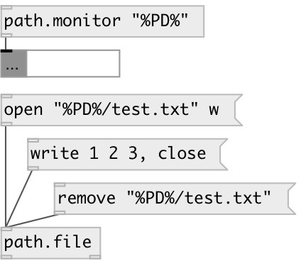

[index](index.html) :: [path](category_path.html)
---

# path.monitor

###### filesystem event monitor

*available since version:* 0.9.5

---

## arguments:

* **PATH**
directory to monitor filesystem events 
_type:_ symbol 

## properties:

* **@path** 
Get/set directory to monitor filesystem events 
_type:_ symbol 

## inlets:

* ... 
_type:_ control

## outlets:

* messages: [create fname(, [update fname(, [move fname(, [remove fname( 
_type:_ control

## keywords:

[path](keywords/path.html)
[filesystem](keywords/filesystem.html)

**Authors:** Serge Poltavsky

**License:** GPL3 or later

