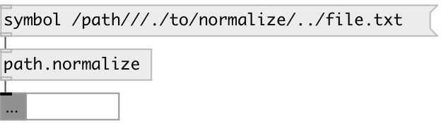

[index](index.html) :: [path](category_path.html)
---

# path.normalize

###### normalize file paths

*available since version:* 0.9.4

---

## information
These conversions are purely lexical. They do not check that the paths exist, do
            not follow symlinks, and do not access the filesystem at all

## inlets:

* file path 
__type:__ control 

## outlets:

* symbol or data:string: normalized path
__type:__ control 

## keywords:

[path](keywords/path.html)
[normalize](keywords/normalize.html)

**See also:**
[\[path.split\]](path.split.html)

**Authors:** Serge Poltavsky

**License:** GPL3 or later

