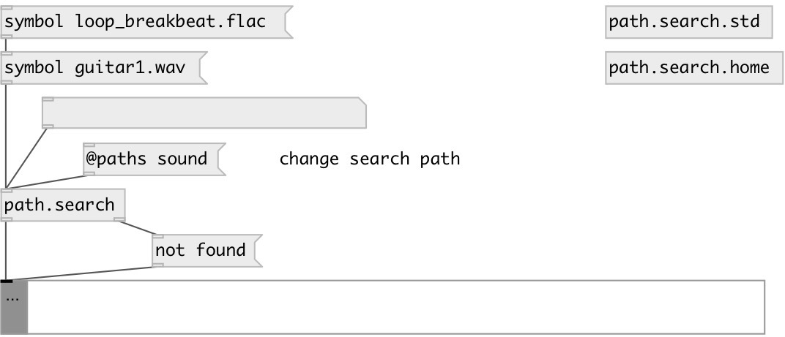

[index](index.html) :: [path](category_path.html)
---

# path.search

###### file search

*available since version:* 0.9.4

---

## information
Searches file by name in user specified or PureData system paths. Outputs first found file. Search order: 1. user defined paths (@path property), 2. current patch directory, 3. PureData system path, 4. home directory. Absolute paths processed before relative. Home directory can be specified with &#39;~&#39; symbol. Note: by default search request is performed asynchronously, so a delay will occured between input and output.

## arguments:

* **PATHS**
list of paths, can be quoted to handle whitespace. 
_type:_ list 

## methods:

* **cancel**
cancel search process 

## properties:

* **@async** 
Get/set perform async search in separate thread 
_type:_ bool 
_default:_ 1 

* **@sync** 
Get/set alias to @async 0 
_type:_ alias 

* **@depth** 
Get/set search recursion depth (-1: infinite) 
_type:_ int 
_min value:_ -1 
_default:_ 0 

* **@paths** 
Get/set user defined search paths 
_type:_ list 

* **@home** 
Get/set search in home directory 
_type:_ bool 
_default:_ 1 

* **@std** 
Get/set search in PureData standard directory 
_type:_ bool 
_default:_ 1 

* **@nohome** 
Get/set alias to @home 0, do not search in home directory 
_type:_ alias 

* **@nostd** 
Get/set alias to @std 0, do not search in standard dirs 
_type:_ alias 

## inlets:

* filename 
_type:_ control

## outlets:

* symbol: full filename 
_type:_ control
* bang: if not found 
_type:_ control

## keywords:

[path](keywords/path.html)
[environment](keywords/environment.html)

**See also:**
[\[file.size\]](file.size.html)

**Authors:** Serge Poltavsky

**License:** GPL3 or later

