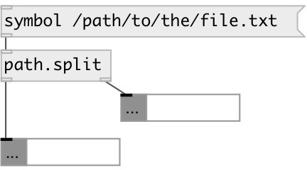

[index](index.html) :: [path](category_path.html)
---

# path.split

###### file path split

*available since version:* 0.9.4

---

## information
Split filename to dirname and basename.

## inlets:

* filename 
__type:__ control 

## outlets:

* symbol: dirname
__type:__ control 
* symbol: basename
__type:__ control 

## keywords:

[path](keywords/path.html)
[environment](keywords/environment.html)

**See also:**
[\[file.size\]](file.size.html)

**Authors:** Serge Poltavsky

**License:** GPL3 or later

