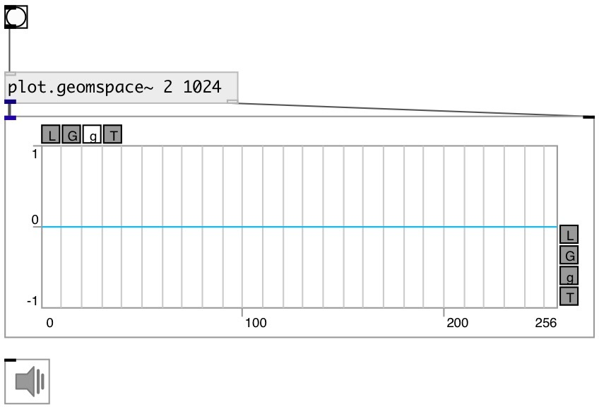

[index](index.html) :: [array](category_array.html)
---

# plot.geomspace~

###### outputs numbers spaced evenly on a log scale (a geometric progression)

*available since version:* 0.9

---

## arguments:

* **START**
@start property 
_type:_ float 

* **STOP**
@stop property 
_type:_ float 

* **N**
@n property 
_type:_ int 

* **BASE**
x-axis scale base 
_type:_ atom 

## properties:

* **@start** 
Get/set the starting value of the sequence 
_type:_ float 
_min value:_ 0 
_default:_ 0.1 

* **@stop** 
Get/set the final value of the sequence, unless @endpoint is false. In that case, @n +
1 values are spaced over the interval in log-space, of which all but the last
(a sequence of length @n) are returned. 
_type:_ float 
_min value:_ 0 
_default:_ 100 

* **@n** 
Get/set number of points 
_type:_ int 
_range:_ 4..1024 
_default:_ 100 

* **@base** 
Get/set x-axis scale base 
_type:_ atom 
_enum:_ 10, 2, e 
_default:_ 10 

* **@2** 
Get/set alias to @base 2 
_type:_ atom 

* **@10** 
Get/set alias to @base 10 
_type:_ atom 

* **@e** 
Get/set alias to @base e 
_type:_ atom 

* **@endpoint** 
Get/set include @stop to interval 
_type:_ bool 
_default:_ 1 

## inlets:

* starts output 
_type:_ control

## outlets:

* signal output 
_type:_ audio
* output to [array.plot~] or [ui.plot~] 
_type:_ control

## keywords:

[array](keywords/array.html)
[geom](keywords/geom.html)
[log](keywords/log.html)
[scale](keywords/scale.html)

**See also:**
[\[plot.linspace~\]](plot.linspace~.html)
[\[plot.logspace~\]](plot.logspace~.html)

**Authors:** Serge Poltavsky

**License:** GPL3 or later

