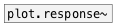

[<<< reference home](ceammc_lib.md)
---

# plot.hist~

```


[noise.white~] [osc~ 40 #a]
|
|              [ui.hrd @nitems 2 #c]
|
[flow.multiplex~ 2 #b] [bang(
|                      |
[plot.hist~ 2048 @nbins 32]
|            ^|.
[ui.plot~ @size 300 150 @xlabels 1 @ylabels 1 @xmin_grid 1 @ymin_ticks 0 @ymaj_ticks 0 @xmin_ticks 0 @ymin 0 @ymax 100 @mode bars @plot_color0 0.2 0.2 0.2]


[ui.dsp~]
[X a->b:1]
[X c->b:2]

            
```
---
calculate and output signal histogram
---
arguments:

NSAMP: @nsamp property<br>

---
properties:

@nsamp: max
            number of input samples<br>
@nbins: number of
            histogram bins<br>
@min: minimal input value<br>
@max: maximum input value<br>
@clip: clip input values into input
            range, otherwise just ignore them<br>

---
see also:<br>
[](plot.linspace~.md)
[](plot.geomspace~.md)
[](plot.response~.md)
