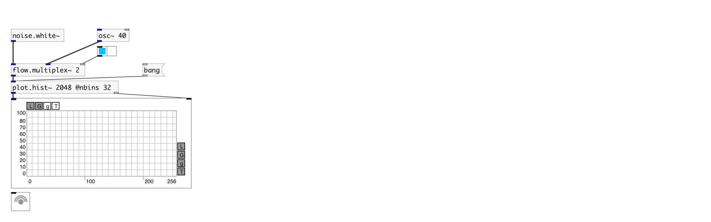

[< reference home](index.html)
---

# plot.hist~

calculate and output signal histogram

---

 

---

---
arguments:

NSAMP: @nsamp property 

---
properties:

@nsamp: max
            number of input samples 
@nbins: number of
            histogram bins 
@min: minimal input value 
@max: maximum input value 
@clip: clip input values into input
            range, otherwise just ignore them 

---
see also: 

