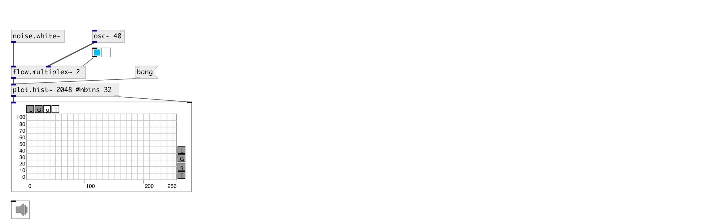

[index](index.html) :: [array](category_array.html)
---

# plot.hist~

###### calculate and output signal histogram

*available since version:* 0.9

---

## arguments:

* **NSAMP**
@nsamp property 
_type:_ int 

## properties:

* **@nsamp** 
Get/set max number of input samples 
_type:_ int 
_range:_ 8..32768 
_default:_ 512 

* **@nbins** 
Get/set number of histogram bins 
_type:_ int 
_range:_ 8..512 
_default:_ 63 

* **@min** 
Get/set minimal input value 
_type:_ float 
_default:_ -1 

* **@max** 
Get/set maximum input value 
_type:_ float 
_default:_ 1 

* **@clip** 
Get/set clip input values into input range, otherwise just ignore them 
_type:_ int 
_enum:_ 0, 1 
_default:_ 1 

## inlets:

* starts histogram calculation 
_type:_ audio

## outlets:

* signal output 
_type:_ audio
* output to [array.plot~] or [ui.plot~] 
_type:_ control

## keywords:

[array](keywords/array.html)
[histogram](keywords/histogram.html)

**See also:**
[\[plot.linspace~\]](plot.linspace~.html)
[\[plot.geomspace~\]](plot.geomspace~.html)
[\[plot.response~\]](plot.response~.html)

**Authors:** Serge Poltavsky

**License:** GPL3 or later

