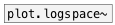

[< reference home](index.html)
---

# plot.linspace~

outputs numbers spaced evenly spaced over a specified
            interval

---

 

---

---
arguments:

---
properties:

@start: the starting value of the
            sequence 
@stop: the final value of the
            sequence, unless @endpoint is false. In that case, @n + 1 values are spaced over the
            interval in lin-space, of which all but the last (a sequence of length @n) are
            returned. 
@n: number of
            points 
@base: x-axis scale base 
@pi: alias to @base pi 
@endpoint: include @stop to
            interval 

---
see also: 

