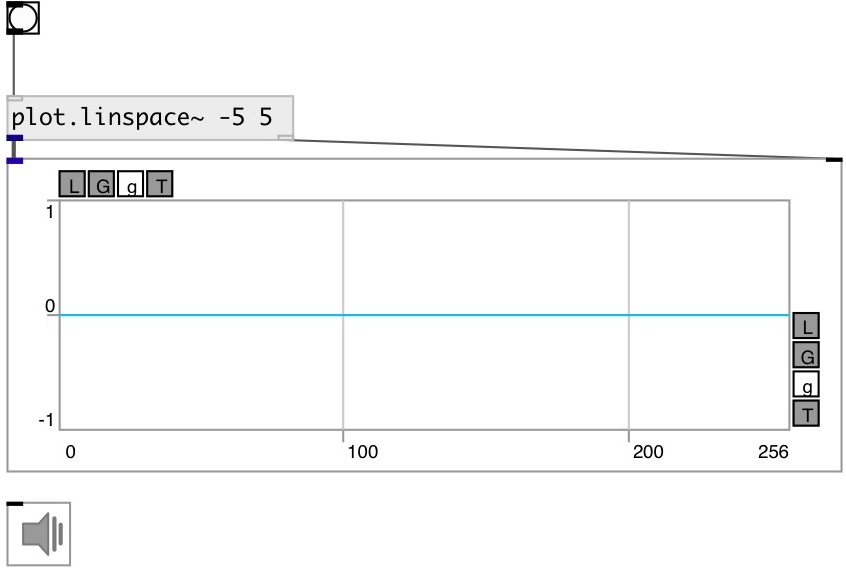

[index](index.html) :: [array](category_array.html)
---

# plot.linspace~

###### outputs numbers spaced evenly spaced over a specified
            interval

*available since version:* 0.9

---

## properties:

* **@start** 
Get/set the starting value of the sequence 
__type:__ float 
__min value:__ 0 
__default:__ 0 

* **@stop** 
Get/set the final value of the sequence, unless @endpoint is false. In that case, @n +
1 values are spaced over the interval in lin-space, of which all but the last
(a sequence of length @n) are returned. 
__type:__ float 
__min value:__ 0 
__default:__ 255 

* **@n** 
Get/set number of points 
__type:__ int 
__range:__ 4..1024 
__default:__ 256 

* **@base** 
Get/set x-axis scale base 
__type:__ atom 
__enum:__ 0, pi 
__default:__ 0 

* **@pi** 
Get/set alias to @base pi 
__type:__ atom 

* **@endpoint** 
Get/set include @stop to interval 
__type:__ int 
__enum:__ 0, 1 
__default:__ 1 

## inlets:

* starts output 
__type:__ control 

## outlets:

* signal output
__type:__ audio 
* output to [array.plot~] or [ui.plot~]
__type:__ control 

## keywords:

[array](keywords/array.html)
[linear](keywords/linear.html)
[scale](keywords/scale.html)

**See also:**
[\[plot.geomspace~\]](plot.geomspace~.html)
[\[plot.logspace~\]](plot.logspace~.html)

**Authors:** Serge Poltavsky

**License:** GPL3 or later

