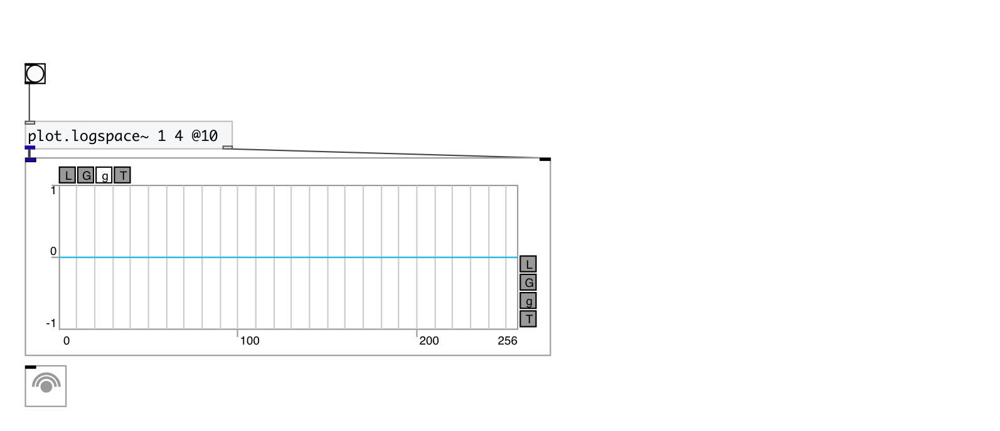
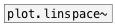
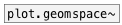

[< reference home](index.html)
---

# plot.logspace~

outputs numbers spaced evenly on a log scale

---

In linear space, the sequence starts at base^start (base to the power of start)
            and ends with base^stop (see @endpoint).
 

---

---
arguments:

start: @start property 
stop: @stop property 

---
properties:

@start: starting value of the
            sequence: base^start 
@stop: the final value
            (base^stop) of the sequence, unless @endpoint is false. In that case, @n + 1 values are
            spaced over the interval in log-space, of which all but the last (a sequence of length
            @n) are returned. 
@n: number of
            points 
@base: x-axis scale
            base 
@2: alias to @base 2 
@10: alias to @base 10 
@e: alias to @base e 
@endpoint: include @stop to
            interval 

---
see also: 

