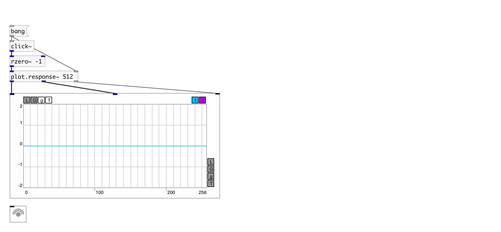

[< reference home](index.html)
---

# plot.response~

output amp/phase freq response to impulse

---

 

---

---
arguments:

N: @n property 

---
properties:

@n: number of
            processed samples 
@db: decibel mode. It true outputs
            amplitude in decibels 
@sr: using samplerate. If true output
            in [0..SR/2] instead of [0..pi] 

---
see also: 

