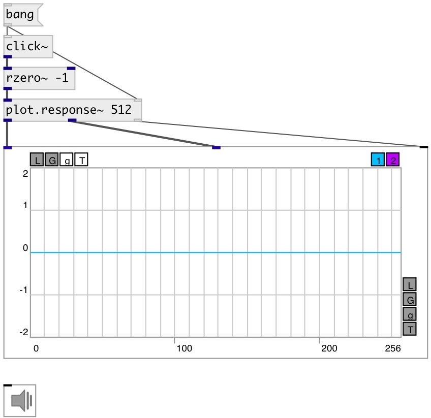

[index](index.html) :: [array](category_array.html)
---

# plot.response~

###### output amp/phase freq response to impulse

*available since version:* 0.9

---

## arguments:

* **N**
@n property 
__type:__ int 

## properties:

* **@n** 
Get/set number of processed samples 
__type:__ int 
__range:__ 32..8192 
__default:__ 512 

* **@db** 
Get/set decibel mode. It true outputs amplitude in decibels 
__type:__ int 
__enum:__ 0, 1 
__default:__ 0 

* **@sr** 
Get/set using samplerate. If true output in [0..SR/2] instead of [0..pi] 
__type:__ int 
__enum:__ 0, 1 
__default:__ 0 

## inlets:

* input signal 
__type:__ audio 
* starts response calculation 
__type:__ control 

## outlets:

* frequency response
__type:__ audio 
* phase response
__type:__ audio 
* output to [array.plot~] or [ui.plot~]
__type:__ control 

## keywords:

[array](keywords/array.html)
[histogram](keywords/histogram.html)

**See also:**
[\[plot.linspace~\]](plot.linspace~.html)
[\[plot.geomspace~\]](plot.geomspace~.html)

**Authors:** Serge Poltavsky

**License:** GPL3 or later

