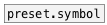

[< reference home](index.html)
---

# preset.float


load/store float preset

---

Named float preset entry. Can store/load up to 16 various float values
<br>


---


```


               [store 0(  [store 1(
               |          |
      [load 0( | [load 1( |
      |        | |        |
      |        | |        |
      |        | |        |
[F] X [preset.float     f1]


            
```

---
arguments:

ID: preset id (should be unique in most use
            cases)<br>
VAL: preset initial value<br>

---
properties:

@path: property OSC-like path that
            includes id, abstraction name and may be subpatch name separated by slashes.<br>
@id: preset id<br>
@init: init float value<br>
@global: use global path like /ID<br>
@subpatch: include subpatch name to path<br>

---
see also:<br>
[](preset.storage.html)
[](preset.symbol.html)
[](preset.list.html)
