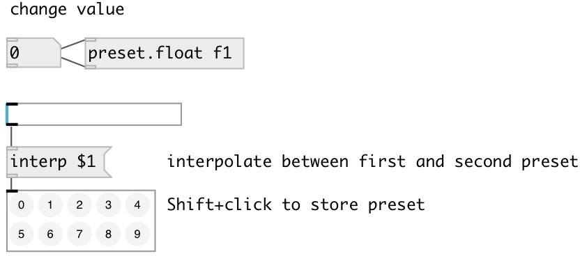

[index](index.html) :: [preset](category_preset.html)
---

# preset.float

###### load/store float preset

*available since version:* 0.4

---

## information
Named float preset entry. Can store/load up to 256 various float values

## arguments:

* **ID**
preset id (should be unique in most use cases) 
__type:__ symbol 

* **VAL**
preset initial value 
__type:__ float 

## methods:

* **load**
load preset value by specified index and output it 

* **store**
stores preset value at specified index 

* **clear**
clear preset at specified index 

* **interp**
linearly interpolate between preset indexes and output 

## properties:

* **@path** (readonly)
Get property OSC-like path that includes id, abstraction name and may be subpatch
name separated by slashes. 
__type:__ symbol 

* **@id** (readonly)
Get preset id 
__type:__ symbol 

* **@init** 
Get/set init float value 
__type:__ float 
__default:__ 0 

* **@global** 
Get/set use global path like /ID 
__type:__ flag 
__default:__ 0 

* **@subpatch** 
Get/set include subpatch name to path 
__type:__ flag 
__default:__ 0 

## inlets:

* set preset value without output 
__type:__ control 

## outlets:

* preset float value
__type:__ control 

## keywords:

[preset](keywords/preset.html)
[storage](keywords/storage.html)
[float](keywords/float.html)

**See also:**
[\[preset.storage\]](preset.storage.html)
[\[preset.symbol\]](preset.symbol.html)
[\[preset.list\]](preset.list.html)

**Authors:** Serge Poltavsky

**License:** GPL3 or later

