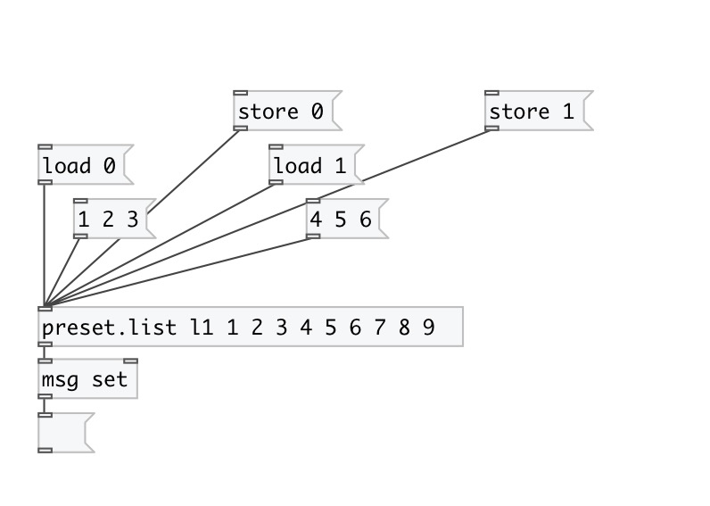

[< reference home](index.html)
---

# preset.list

load/store symbol preset

---

Named list preset entry. Can store/load up to 16 various lists
 

---

---
arguments:

ID: preset id (should be unique in most use
            cases) 
VALUES: preset initial value 

---
properties:

@path: property OSC-like path that
            includes id, abstraction name and may be subpatch name separated by slashes. 
@id: preset id 
@init: init list value 
@global: use global path like /ID 
@subpatch: include subpatch name to path 

---
see also: 

