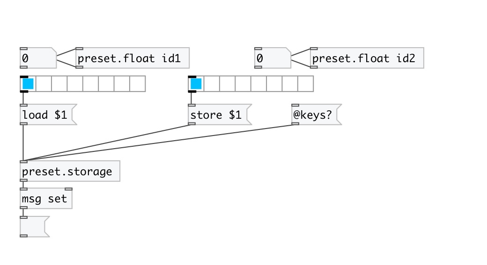

[< reference home](index.html)
---

# preset.storage

preset storage control

---

Preset storage allows to load and store presets, read and write them to
            files
 

---

---
arguments:

---
properties:

---
see also: 

